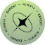
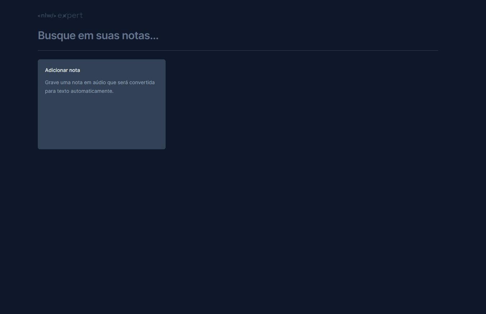

<h1 align="center">  NLW-Expert  </h1>

Design challenge

This project was made following Rocketseat's design, you can see the challenge by <a href="https://www.rocketseat.com.br/?utm_source=google&utm_medium=cpc&utm_campaign=lead&utm_term=perpetuo&utm_content=institucional-lead-home-texto-lead-brandkws-none-none-institucional-none-none-br-google&gclid=Cj0KCQjw8NilBhDOARIsAHzpbLDM_cVTTXtTZwkbS3sOjoQdaXI4LU_G_pIM7rUxfaVJ9WSqQlTCWzMaAqZ8EALw_wcB">clicking here.</a>

<h2>⚙️Tecnologias</h2>

<h2>🚀Brief</h2>

Your challenge is to build out this landing page and get it looking as close to the design as possible.

<h2>❔ How to Use </h2>

Before cloning the repository into your machine you'll need <a href="https://git-scm.com/">Git</a>. Also it is good to have a code editor like <a href="https://code.visualstudio.com/">VSCode.</a>
<blockquote>
 Clone this repository

 Go into the repository

 Install dependencies with
  - npm install or yarn

 Run app
 - npm start or yarn dev
</blockquote>

<h2>🗣 Author </h2>

Made with ❤️ by Gustavo Barboza

   
   

